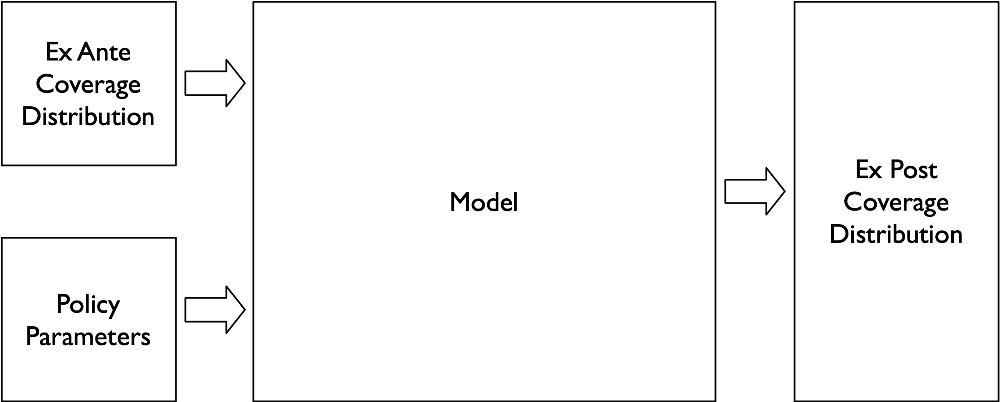

```{r setup, include=FALSE}
knitr::opts_chunk$set(
	echo = FALSE,
	message = FALSE,
	warning = FALSE,
	cache = TRUE
)
# Load packages and source functions. 
source(here::here("R/manifest.R"))
source(here::here("R/prepare-multistate-data.R"))
source(here::here("R/fit-multistate-model.R"))
source(here::here("R/get-cumulative-hazard.R"))
source(here::here("R/add-binary-indicators.R"))

insurance_sipp_lut <- c(
  "cat_1" = "01_esi",
  # "cat_2" = "02_esi_dep",
  "cat_2" = "02_priv_oth",
  "cat_3" = "03_public",
  "cat_4" = "04_uninsured"
)
```

# Introduction 

Models projecting the impact of reforms to health insurance programs and markets play an important role in shaping U.S. health policy.  For example, in 2017 Congressional attempts to repeal and replace the 2010 Affordable Care Act (ACA) collapsed, in part, under public outcry after the Congressional Budget Office (CBO) [projected](https://www.nytimes.com/2017/05/24/us/politics/cbo-congressional-budget-office-health-care.html) that upwards of 23 million people would become uninsured. The [twists](https://prescriptions.blogs.nytimes.com/2009/10/07/analysis-sees-baucus-bill-meeting-obamas-cost-and-deficit-targets/) [and](https://www.nytimes.com/2009/10/19/us/19iht-letter.html) [turns](https://www.nytimes.com/2009/10/06/health/policy/06health.html) of earlier debates over the ACA--and before it, [the Clinton health plan](figures/01_nyt-clinton-cbo.png)--also were shaped by modelers' assessments of how reform would impact insurance coverage, premiums, health care spending, and government costs. 

Microsimulation models used by the CBO and by others to produce these estimates draw on economic theory and on a large and growing literature evaluating past state and federal reform efforts. Yet while modelers derive many inputs from this shared evidence base, the evidence is uncertain and not in uniform agreement. Models also differ in their structure, underlying data sources and assumptions. It should come as no surprise, then, that models often produce [widely varying projections of the same reform proposal](https://www.nytimes.com/interactive/2019/04/10/upshot/medicare-for-all-bernie-sanders-cost-estimates.html). 

This current state of affairs has subjected microsimulation models to criticism over their "black box" like qualities and their tendency to produce estimates with a limited accompanying sense of uncertainty or sensitivity to alternative parameter values and assumptions. Moreover, modelers have understandably but unfortunately shied away from producing normative assessments of overall welfare impacts. That is, existing models simply produce an array of intermediary point estimates on welfare-relevant outcomes (changes in coverage, premiums, spending and government costs) and leave it to policymakers to weigh those factors when considering policy choices.

This approach to health policy modeling has a number of important shortcomings. First, despite modelers' attempts to caveat the high degree of uncertainty in their estimates, modeled projections are often afforded a false sense of precision in high-stakes policy debates. Second, the "black box" like quality of most models makes it difficult for researchers  to know whether and how their work can inform and improve modeling efforts. The development, execution, and maintenance costs of microsimulation models are also considerable. Combined, these factors  contribute to a muddled sense of how the health economic and policy research enterprise could be directed and refined to optimize policy impact. 

This study outlines an approach to ex ante policy evaluation that addresses many of the above shortcomings. First, I outline a generalized discrete time modeling framework for assessing the cost, coverage and welfare impact of health reform policies. This simple yet powerful framework has roots in health economic modeling methods often used for health technology assessments, as well as in the "sufficient statistics" approach to welfare evaluation developed in public finance. I demonstrate that this modeling framework not only encompasses many existing approaches to health policy microsimulation, but also lends itself counterfactual policy evaluations based only on reduced form estimates. That is, the framework allows researchers to investigate the coverage and cost impacts of  reform alternatives without the need for detailed individual-level microsimulation modeling.  As a proof of concept of this approach, I demonstrate how evidence on the impact of Medicaid expansion derived from a difference-in-difference study design, combined with regression-discontinuity estimates on willingness to pay for subsidized health insurance (Finkelstein, Hendren and Shepard 2019) can be harnessed to model the impact of expansion of coverage via public programs versus via targeted subsidies for private coverage. 

Second, within this framework I tie together imoportant but diverse approaches to assessing uncertainty and the welfare impacts of policy. Specifically, I draw linkages between standard welfare measures used in health economic evaluation (e.g., net health and monetary benefits of health technologies and policies) and the marginal value of public funds (MVPFs) developed in a series of important studies by Hendren. This linkage allows for a systematic approach to understanding modeling and parameter uncertainty using probabilistic sensitivity analyses (PSAs) and value of information (VOI) methods. 



# Health Reform Modeling as a Discrete Time Markov Process

This section outlines a simple discrete time markov model for health insurance coverage in the U.S. population. We begin by defining an ex ante occupancy vector $\mathbf{p_{exa}}$ that summarizes the fraction of the population in each major health insurance type (employer-sponsored insurance, other private insurance, public insurance, and uninsured) in the pre-reform period.

\[
\mathbf{p_{exa}}=
\left(
\begin{array}{c}
p_{exa,esi}\\
p_{exa,pri}\\
p_{exa,pub}\\
p_{exa,unin}
\end{array}
\right) 
\]
where $p_{exa,k}$ is the fraction of the population in each insurance category $k$ in the ex ante period.

Now define the transition probability matrix:

\[
\mathbf{R} =  [r_{k,j}] =   
\begin{pmatrix}
      r_{esi,esi} & r_{esi,pri} & r_{esi,pub} & r_{esi,unin}  \\
       r_{pri,esi} & r_{pri,pri} & r_{pri,pub} & r_{pri,unin}  \\
        r_{pub,esi} & r_{pub,pri} & r_{pub,pub} & r_{pub,unin}  \\
         r_{unin,esi} & r_{unin,pri} & r_{unin,pub} & r_{unin,unin}  
    \end{pmatrix}
\]
where $r_{k,j}$ is the probability of transitioning from ex ante category $k$ to ex post category $j$.

Finally, we can define an ex post occupancy vector:

\[
\mathbf{p_{exp}}=
\left(
\begin{array}{c}
p_{exp,esi}\\
p_{exp,pri}\\
p_{exp,pub}\\
p_{exp,unin}
\end{array}
\right) 
\]

Basic matrix algebra links the two occupancy vectors as follows: 

\[
\begin{aligned}
    \begin{pmatrix}
p_{exa,esi}\\
p_{exa,pri}\\
p_{exa,pub}\\
p_{exa,unin} \\
    \end{pmatrix}'
        \cdot
    \begin{pmatrix}
      r_{esi,esi} & r_{esi,pri} & r_{esi,pub} & r_{esi,unin}  \\
       r_{pri,esi} & r_{pri,pri} & r_{pri,pub} & r_{pri,unin}  \\
        r_{pub,esi} & r_{pub,pri} & r_{pub,pub} & r_{pub,unin}  \\
         r_{unin,esi} & r_{unin,pri} & r_{unin,pub} & r_{unin,unin} 
    \end{pmatrix}
    &=&
    \begin{pmatrix}
p_{exp,esi}\\
p_{exp,pri}\\
p_{exp,pub}\\
p_{exp,unin} \\
    \end{pmatrix}'
  \end{aligned}
\]

In the equation above, the set of transition probabilities $r_{k,j}$ can be considered sufficient statistics for evaluating the impact of a policy change on health insurance coverage in the population. That is, once we know these probabilities and how they change under a given reform option, we can simulate the impact on the overall coverage distribution in the population. By attaching costs to population movements among insurance types, we can simulate the cost impact to the government. And finally, as we show below, social welfare weights can also be attached to population movements. These weights can then be aggregated and compared across reform alternatives to make normative assessments of policy options. 

### Estimating the Transition Probability Matrix

We first obtain a simple cross tabulation of insurance coverage in January 2013 from the SIPP. 

```{r, echo = FALSE}
# source(here("R/estimate-overall-transition-probability-matrix.R"))
ex_ante <- 
  read_rds(here("output/ex-ante-overall-population/ex-ante-distribution.rds"))
ex_ante_meps <- 
  read_rds(here("output/ex-ante-overall-population/ex-ante-distribution-meps.rds"))

ex_ante %>% 
  mutate(n = round(n/1e6,1)) %>% 
  mutate(pct = round(100*pct,1)) %>% 
  mutate(insurance_type = c("ESI","Private-Other","Public","Uninsured")) %>% 
  cbind(
    ex_ante_meps %>% 
    mutate(n = round(n/1e6,1)) %>% 
    mutate(pct = round(100*pct,1)) %>% 
    select(-insurance_type) 
  ) %>% 
  knitr::kable(caption = "Ex Ante Distribution of Insurance Coverage, January 2013",col.names= c("Category","SIPP: Number (millions)","SIPP: Percent", "MEPS: Number (millions)","MEPS: Percent"), format = "html")
```

Next we fit nonpaarametric (Kaplan-Meier) and parametric multi-state models to obtain the transition probabilities by December 2013. 

```{r}
trans_probs <- 
    read_rds(here("output/ex-ante-overall-population/transition-probabilities-kaplan-meier.rds"))

trans_probs %>% filter(time==24) %>% pluck("data") %>% pluck(1) %>% 
  mutate_at(vars(-1),function(x) round(100*x,2)) %>% 
  knitr::kable(caption = "Transition Probabilities", format = "html")
```

```{r}
 trans_probs_meps <- 
    read_rds(here("output/ex-ante-overall-population/transition-probabilities-kaplan-meier-meps.rds"))

trans_probs_meps %>% filter(time==24) %>% pluck("data") %>% pluck(1) %>% 
  mutate_at(vars(-1),function(x) round(100*x,2)) %>% 
  knitr::kable(caption = "Transition Probabilities", format = "html")
```

