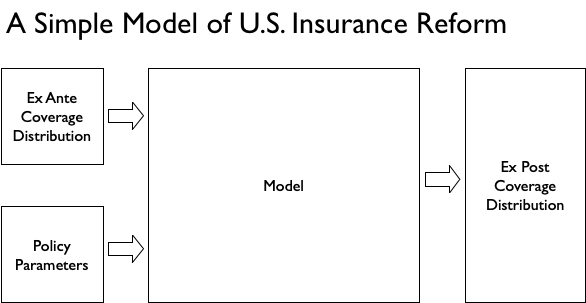
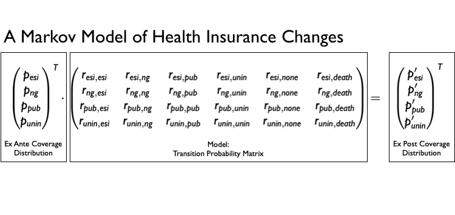

A Sufficient Statistics Approach to Modeling Health Insurance Market
Reform
================

The objective of this repository is to summarize current work on a
sufficient statistics approach to modeling reform of U.S. insurance
markets.

# Overview of Approach

